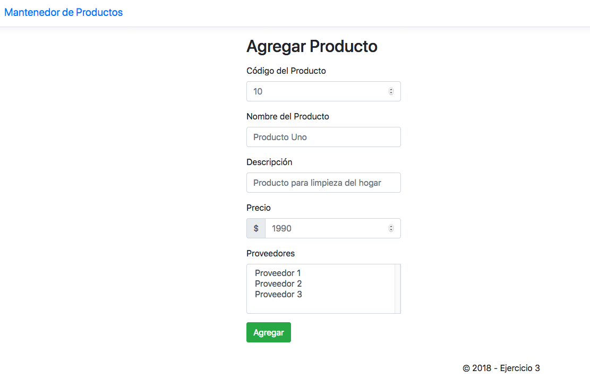
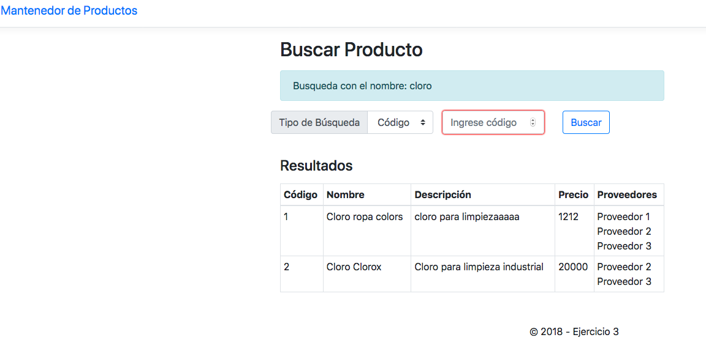

Ejercicio 3 para Taller de Aplicaciones
=======================================

Properties de configuración en src/main/resources/dao.properties

Para compilar considere:

	$ mvn clean package
	
El war resultante: target/ejercicio3.war

