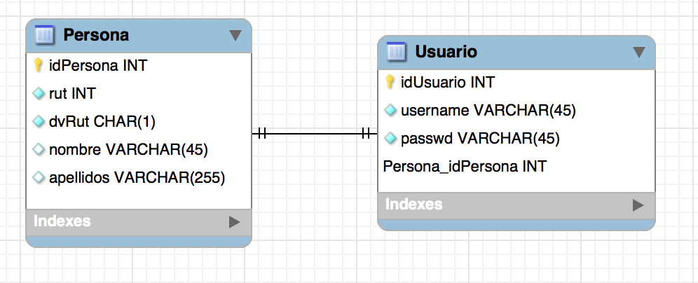
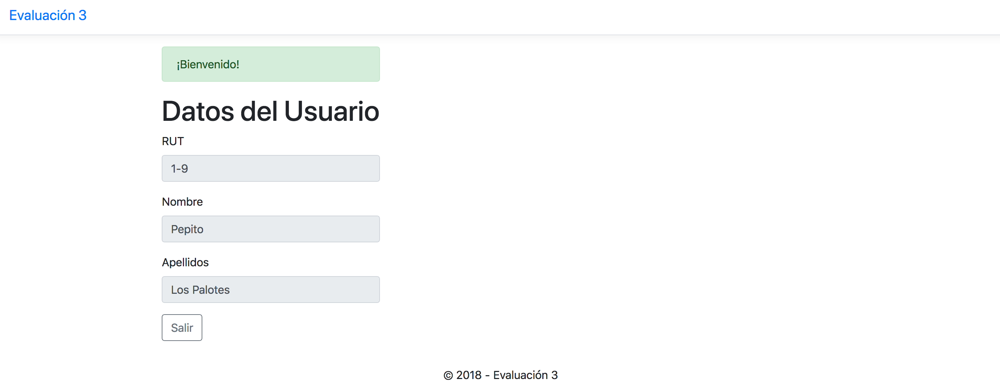

Evaluación 3 para Taller de Aplicaciones
=======================================

Properties de configuración en src/main/resources/dao.properties (verifique sus credenciales a MySQL)

Hay métodos no implementados en la capa DAO debido a que no fueron parte del requerimiento.

Se adicionan los archivos sql a fin de no usar el modelo .mwb (formato MySQL Workbench) y que deben ser ejecutados en secuencia:

- estructura.sql (data structure)
- inserts.sql (datos para tabla Proveedor)

Para compilar considere:

	$ mvn clean package
	
El war resultante: target/evaluacion3.war

Los datos de ejemplo para el usuario son:

- username: plospalotes
- password: 1234